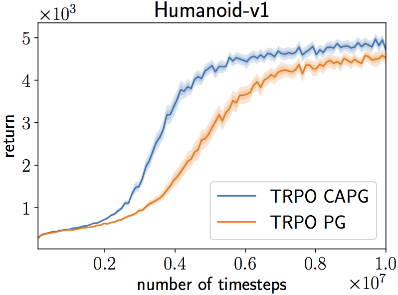

# Clipped Action Policy Gradient

This repository contains the implementation of CAPG (https://arxiv.org/abs/1802.07564) with PPO and TRPO.

## Dependencies

- Chainer v4.1.0
- ChainerRL latest master
- OpenAI Gym v0.9.4 with MuJoCo envs

Use [requirements.txt](requirements.txt) to install dependencies.

```bash
pip install -r requirements.txt
```

## How to run

```bash
# Run PPO with PG and CAPG for 1M steps
python train_ppo_gym.py --env Humanoid-v1
python train_ppo_gym.py --env Humanoid-v1 --use-clipped-gaussian

# Run TRPO with PG and CAPG for 10M steps
python train_trpo_gym.py --env Humanoid-v1 --steps 10000000
python train_trpo_gym.py --env Humanoid-v1 --steps 10000000 --use-clipped-gaussian
```

The figure below shows average returns of training episodes of TRPO with PG and CAPG, both of which are trained for 10M timesteps on Humanoid-v1. See the paper for more results.

<p align="center"></p>


## BibTeX entry

```
@inproceedings{Fujita2018Clipped,
  author = {Fujita, Yasuhiro and Maeda, Shin-ichi},
  booktitle = {ICML},
  title = {{Clipped Action Policy Gradient}}
  year = {2018}
}
```

## License

[MIT License](LICENSE).
